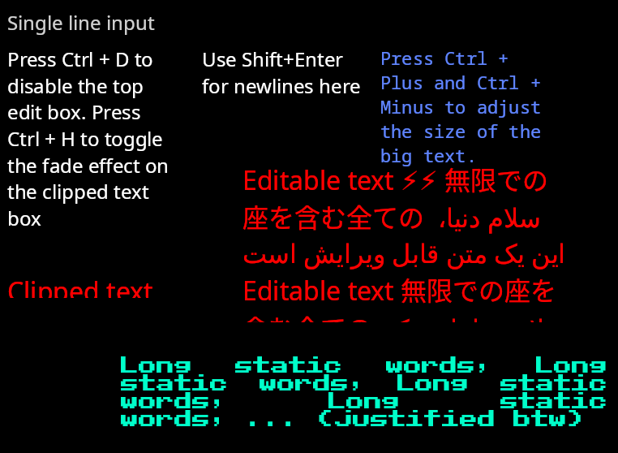

`textslabs` is an experimental high level text library, with the goal to allow any winit/wgpu program to have full-featured text and text editing with minimal integration effort.

This library is based on `parley`, which does most of the hard technical work. `textslabs` manages collections of TextBox and TextEdit objects, keeps track of changes and does relayouts and rerenders when necessary, implements interactive selecting and editing, integrates accessibility, etc.

It also includes an atlas GPU renderer to render the text on the screen.

See the examples in the repository, starting with `minimal.rs`, `full.rs`, and `benchmark.rs` to see how the library can be used. The [documentation for the main branch](https://kekelp.github.io/textslabs/textslabs/index.html) has more information, including a high level overview of the library and how to use it.

## Screenshots

Screenshot of the "full" example:

Windows Narrator narrating text in the "accessibility" example:

https://github.com/user-attachments/assets/be112fe4-a589-4bc0-8205-341fe65082c8

